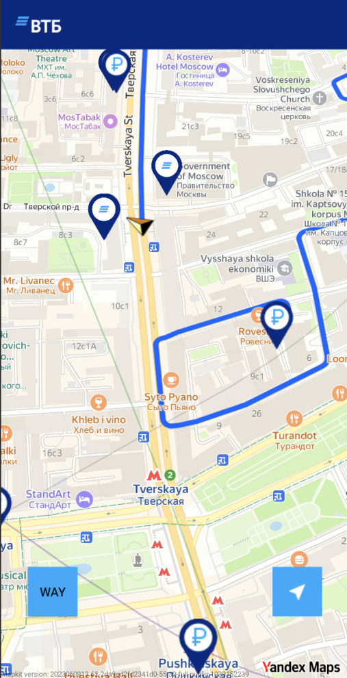
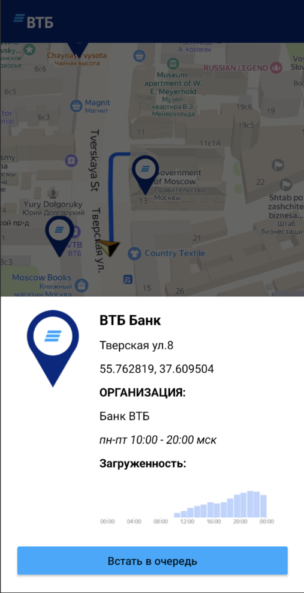
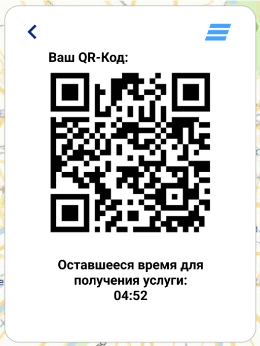
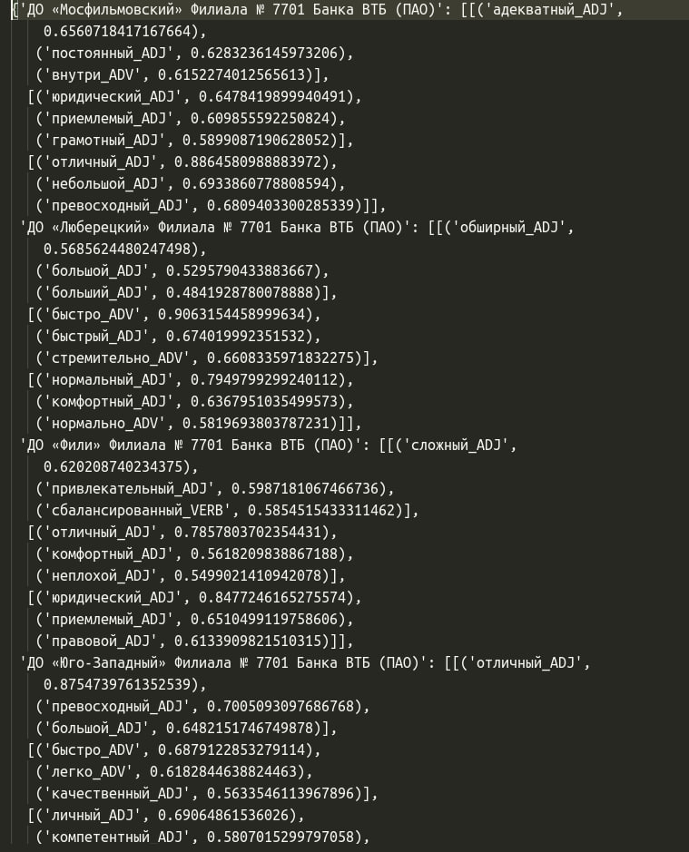

# MobileMap [MORE.Tech 5.0](https://moretech.vtb.ru/)


- Команда _**HyPe Solutions**_
- Кейс _**Mobile**_
- Задача: разработать веб/мобильный сервис
  подбора отделения банка, учитывая
  потребности и удобство клиента.

_Решение позволит клиенту (физическому или
юридическому лицу) получить необходимую ему
услугу в ближайшем отделении, с
минимальными затратами времени на очереди._

## ✍️ Быстрый запуск

Чтобы начать пользоваться
приложением, [достаточно скачать последний релиз из вкладки releases.](https://github.com/kremogen/moretech-MobileMap/releases)

Для удобства использования, мы развернули всю подкапотную сервиса удаленно, но вы, конечно-же, можете развернуть сервер
самостоятельно:

```shell
$ git clone https://github.com/kremogen/moretech-MobileMap
$ cd moretech-MobileMap/api
$ python3 server_api.py
```

## 📌 Примеры работы приложения

<div>
  
  
</div>
<div>
  
  
</div>

## 📄 Логика работы

#### Идея алгоритма

1. Кластеризация отзывов отделения - может помочь разделять отзывы на группы в зависимости от уровня удовлетворенности клиентов. Это может помочь банку быстро выявить общие проблемы и радости клиентов.
2. Выделение ключевых слов (тегов) из полученных кластеров - может помочь выявить, какие конкретные аспекты обслуживания вызывают положительные или отрицательные эмоции.
3. Протестировать разные "пайплайны" при анализе текста (Word2Vec, TF-IDF, Transformers)

#### Реализация алгоритма подбора тегов

1. Парсинг отзывов конкретной организации (отделение банка) с помощью selenium
2. Анализ текстов отзывов, который включает в себя:<br>
   2.1 Предобработка текста (лемматизация и выделение только прилагательных и наречий для описания какое отделение)<br>
   2.2 Создание TF-IDF / Word2Vec эмбеддингов (векторное представление) слов на основе предобработанного корпуса<br>
   2.3 Кластеризация слов в отзывах с помощью алгоритма машинного обучения KMeans<br>
   2.4 Определение ключевого слова в кластерах (получения векторов слов с помощью предобученной word2vec модели на
   национальном корпусе русского языка в полном объёме https://rusvectores.org/ru/models/ и нахождение ближайшего слова
   к усредненному вектору кластера)<br>
   2.5 Определение температуры ключевого слова в % (насколько оно похоже на центр кластера) - можно настроить отображение подсветки тэга от красного 0.0 до зеленого 1.0
3. Анализ сентимента отзывов с помощью предобученной модели huggingface rubert-base-cased-sentiment (
   температура настроения в %)<br>

#### Идея для улучшения

1. Можно извлекать Bigram и Trigram (популярные связки из 2-3 слов в отзывах) для более детального описания отделения
2. Данные после парсинга отзывов содержат время конкретного отзыва, что может быть использовано для анализа тенденций тональности отзывов в определенные промежутки времени
3. Анализ сущностей (добавить части речи - существительные)
4. Сегментация ключевых сущностей из отзывов (выделение ключевых типов для оценки отделения) 


_Получаем теги, а так-же их температуру в процентах (насколько ключевое слово близко к центру кластера)._



[Пример реализации](https://github.com/kremogen/moretech-MobileMap/blob/main/ds/tag_collection.json)

#### Кластеризация

Кластеризация может помочь разделять отзывы на группы в зависимости от уровня удовлетворенности клиентов. Это может
помочь банку быстро выявить общие проблемы и радости клиентов.
Выделение ключевых слов: Анализ ключевых слов может помочь выявить, какие конкретные аспекты обслуживания вызывают
положительные или отрицательные эмоции.

#### Поиск точек

Сервис обращается к базе данных, в которой хранятся координаты других точек, или объектов
интереса, и использует географический радиус для выполнения запроса, который находит все точки в этом радиусе.

Пример получения данных из радиуса 500м:

```groovy
import math

EARTH_RADIUS = 6371210  # Радиус Земли
DISTANCE = 5000  # Интересующее нас расстояние

def compute_delta(degrees):
    return math.pi / 180 * EARTH_RADIUS * math.cos(deg2rad(degrees))

def deg2rad(degrees):
    return degrees * math.pi / 180

latitude = 55.460531  # Интересующие нас координаты широты
longitude = 37.210488  # Интересующие нас координаты долготы

delta_lat = compute_delta(latitude)  # Получаем дельту по широте
delta_lon = compute_delta(longitude)  # Дельту по долготе

around_lat = DISTANCE / delta_lat  # Вычисляем диапазон координат по широте
around_lon = DISTANCE / delta_lon  # Вычисляем диапазон координат по долготе
```
